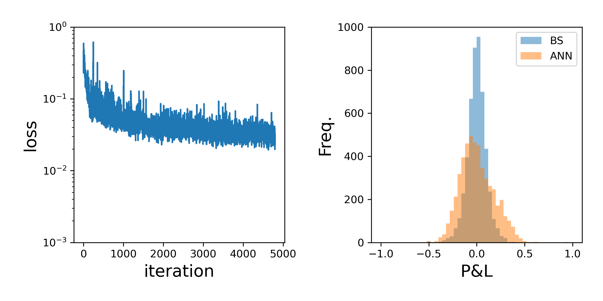
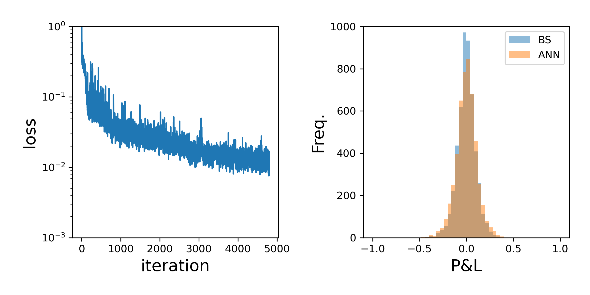
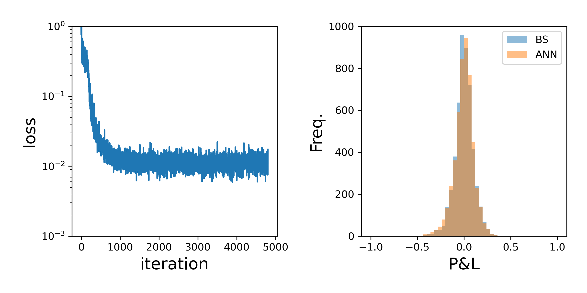

# ANN Hedge

This folder contains an example of using an ANN to learn the hedge strategy in a Black-Scholes model wihtout explicitly targeting the hedge, but rather simply minimising the mean squared profit and loss at terminal time.

Here is an example of the learned distribution with different ANNs 

50 nodes per layer and 1 layer

25 nodes per layer and 2 layers

10 nodes per layer and 5 layers

