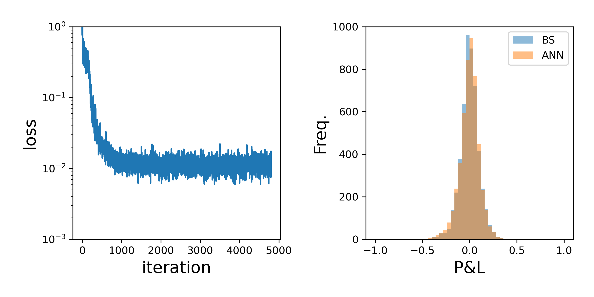

# ANN Hedge

This folder contains an example of using an ANN to learn the hedge strategy in a Black-Scholes model wihtout explicitly targeting the hedge, but rather simply minimising the mean squared profit and loss at terminal time.

Here is an example of the

